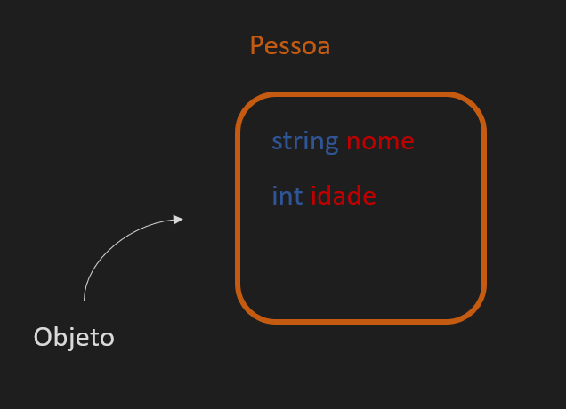
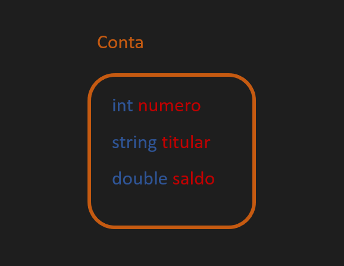

# Aula 4 - Classes e Objetos ([Assista à aula!](https://www.youtube.com/watch?v=IIKQIxQNJ3s))


## Programação procedural e seus problemas

Vamos falar de dados. Seguindo a lógica do curso até agora, podemos guardar dados de uma conta em variáveis. Nome, número de conta, saldo... Fica uma coisa desse tipo:


```cs
int numeroConta = 1; 
string titularConta = "Gunner"; 
double saldoConta = 1000.0; 
```

Ok. Vamos guardar dados para outra pessoa...

```cs
int numeroConta2 = 2; 
string titularConta2 = "Marvin"; 
double saldoConta2 = 2000.0; 
```

Tá vendo o problema aqui? São apenas variáveis, muitas delas. A informação está solta, sem nada para fazer uma conexão. É muito fácil misturarmos essas informações dentro do código. Sem falar que se a gente começar a adicionar coisas do tipo CPF, identidade só vai piorando. Tudo isso são alguns dos problemas do **estilo de programação procedural**. 

E aqui é a nossa deixa para falarmos do primeiro e mais importante conceito do paradigma de programação orientada a objetos: **o objeto**!

## Orientação a Objetos

O que exatamente é um **objeto** na vida real? É qualquer coisa. Por exemplo, um carro. Carros possuem características que o tornam um carro: motor, rodas, volante etc. Ou seja, tem um conjunto de, bem... Outras coisas! Em programação é bem similar... Pense numa caixa, vamos chamar essa caixa de **Pessoa**. Uma pessoa tem algumas informações... Nome e idade por exemplo. Ambas são variáveis.




Podemos então dizer que o objeto é a caixa, e as variáveis é o conteúdo dela. Assim podemos referenciar a pessoa apontando para a caixa, e ela vai conter as informações que precisamos.

Voltando ao nosso exemplo, toda Conta Bancária tem um número, nome de titular e saldo. Mais ou mesmo a mesma coisa, né?



Falta só representarmos essa caixa em programação. Aqui introduzimos o conceito de **classe**. A classe é o que usamos como base para criar um objeto, ou, na nomenclatura correta, **um objeto é uma instância de uma classe**. É como se a classe fosse a receita para um bolo, e o objeto fosse o bolo em si. Se ficou confuso, vai seguindo que vai ter mais exemplos pela frente.

Uma classe fica em um arquivo de codigo separado que roda junto do projeto. No Visual Studio, para criar uma classe, clique com botão direito no projeto (atenção: não na solução) > Adicionar > Classe. No nome coloque "Conta.cs" e clique em "Adicionar".

Isso vai criar um arquivo de classe chamado Conta.cs. Duplo clique nesse arquivo e você vai vê-lo com o seguinte código:

```cs
class Conta
{
}
```
No momento essa conta está vazia. Vamos colocar as variáveis que vimos antes nela:

```cs
class Conta
{
    int numeroConta;
    string titularConta; 
    double saldoConta; 
}
```

Com isso dizemos que *numeroConta*, *titularConta* e *saldoConta* fazem parte de uma *Conta*. Tem mais uma coisa que precisamos fazer... Como essas variáveis agora estão dentro da classe *Conta*, não podemos mais acessá-las diretamente. **Para permitir isso precisamos dizer que essas variáveis são públicas**. Fazemos isso ao adicionar a palavra *public* antes do tipo de cada variável:

```cs
class Conta
{
    public int numeroConta;
    public string titularConta; 
    public double saldoConta; 
}
```

Agora vamos dar duplo clique no nosso *Program.cs* de novo e vamos criar novos objetos Conta!

Para instanciar uma Conta, vamos usar uma nova **palavra reservada**[1]: *new*

```cs
new Conta();
```

A palavra *new* cria **uma nova instância da classe *Conta***. Assim como qualquer variável, **podemos guardar essa instância numa variável** em que o **tipo** dessa variável é **Conta**. Fica assim:

```cs
Conta c = new Conta();
```

Sim, **a classe é o tipo**. Ela é bem parecido com os tipos *double* e *int* que já vimos mas existem algumas pequenas diferenças. Esses são **tipos primitivos** enquanto que *Conta* aqui é um **tipo complexo**. O canal tem uma aula extra sobre **tipos primitivos**, além de ter também uma aulas extra sobre **tipos complexos**. Dê uma olhada se quiser saber mais sobre eles!

Agora que temos uma instância de conta, podemos guardar valores nas suas variáveis internas! Repetindo o primeiro exemplo da aula, fica assim:

```cs
Conta c = new Conta();
c.numeroConta = 1
c.titularConta = "Gunner";
c.saldoConta = 1000.0;
```

## Métodos

Lembra que uma conta tem saldo? Agora, vamos fazer um saque. Lembrando que o valor da transferência não pode ser maior do valor que temos de saldo. Fica assim:

```cs
Conta c = new Conta();
c.numeroConta = 1
c.titularConta = "Gunner";
c.saldoConta = 1000.0;

double valorSaque = 500.0;

if (c.saldoConta >= valorSaque)
{
    c.saldoConta -= valorSaque;
}

```

Ok. **Mas então toda vez que a gente precisar fazer uma transferência vamos ter que copiar esse mesmo if e colar em outros lugares**... Tem um jeito melhor: usando métodos!

Como dito antes, coisas tem informações, e algumas vezes também tem comportamentos. Voltando ao exemplo do Carro, ele tem volante, rodas, motor etc. Mas também podemos dizer que o carro anda, liga, desliga, entre outros. Como programação é um certo tipo de magia, podemos programar comportamentos!


No caso queremos fazer um comportamento para conta: *Saca*!

Na verdade não é nada de mais, é só ter a sintaxe que já aprendemos com if/for em um bloco de código separado. Mas é mais legal apresentar assim!

Voltando à nossa classe *Conta*, declaramos um método:

```cs
class Conta
{
    public int numeroConta;
    public string titularConta; 
    public double saldoConta; 

    // Update a partir daqui
    public void Saca()
    {
    }
}
```

E dentro desse saca colocamos aquele if, fica assim:

```cs
public void Saca()
{
    if (c.saldoConta >= valorSaque)
    {
        c.saldoConta -= valorSaque;
    }
}
```

Calma, calma, calma... **Isso tá errado**. Porque agora estamos dentro da classe *Conta*, então não temos acesso nem às variáveis *c* e *valorSaque*. Vamos com calma...

Primeiro, não precisamos da variável *c*. Usamos a variável que representa uma *Conta* para dizer que queremos alterar uma das suas variáveis internas, no caso, *saldoConta*. Mas agora nós **estamos dentro da classe *Conta***. Assim, podemos acessar diretamente a variável *saldoConta*.

Pronto, esse foi fácil. Agora, a variável *valorSaque* não é parte da classe Conta! Queremos então **passar essa variável para o método Saca**. Para fazer isso vamos definir um **parâmetro** para o método Saca. Métodos podem ter qualquer quantidade de parâmetros. no caso vamos criar um parâmetro chamado "valorSaque":

```cs
public void Saca(double valorSaque)
```

Pronto. Nossa classe está pronta para ter seu método Saca chamado! Vamos voltar para *Program.cs* e vamos substituir aquele if por essa chamada:

```cs
Conta c = new Conta();
c.numeroConta = 1
c.titularConta = "Gunner";
c.saldoConta = 1000.0;

double valorSaque = 500.0;

c.Saca(valorSaque);
```

Pronto! Em vez de repetirmos aquele if, é só chamar:

```cs
c.Saca(valorSaque);
```

## Valores de retorno

Agora tem um problema. O *if* no nosso método só executa se o *saldoConta* for **maior do que o *valorSaque***. Isso está certo, mas agora a pessoa que chama Saca de outra classe não fica sabendo o que aconteceu, se entrou ou não no if. 

Para resolver esse problema precisamos fazer com que o método devolva um valor boolean que indica se a operação de saque foi ou não bem sucedida. Assim, vamos fazer ela devolver **true** caso seja bem sucedida, e **false** caso falhe.

Quando um método não devolve nenhum valor, deixamos isso claro para o compilador usando a palavra reservada **void**. É como foi feito o nosso método, e agora você sabe o que significa :)

```cs
public void Saca(double valorSaque)
```

Como queremos que esse método devolva um valor booleano, trocamos o void pelo tipo *bool*

```cs
public bool Saca(double valorSaque)
```

Agora o Visual Studio vai sublinhar o nome do método de vermelho. Isso acontece porque agora estamos dizendo que vamos devolver um *boolean*, mas não estamos devolvendo nada (void)! Precisamos adicionar então a palavra chave **return** com o valor correto:

```cs
public bool Saca()
{
    if (c.saldoConta >= valorSaque)
    {
        c.saldoConta -= valorSaque;
        return true;
    }
}
```
Mas espera... **O Visual Studio AINDA está reclamando!**. Se colocarmos o mouse no sublinhado ele vai dizer algo do tipo: "Nem todos os caminhos de código retornam um valor". E ele tem razão (ele sempre tem razão).

Se por acaso o *valorSaque* for maior que o *saldoConta*, o código não vai executar o if e depois não vai retornar nada! Por isso, temos de por um else com o valor de retorno caso não entre no if:

```cs
public bool Saca()
{
    if (c.saldoConta >= valorSaque)
    {
        c.saldoConta -= valorSaque;
        return true;
    }
    else
    {
        return false;
    }
}
```

Agora sim, **sem sublinhados vermelhos do inferno**, podemos voltar para o *Program.cs* para imprimir o resultado:

```cs
Conta c = new Conta();
c.numeroConta = 1
c.titularConta = "Gunner";
c.saldoConta = 1000.0;

double valorSaque = 500.0;

bool resultado = c.Saca(valorSaque);

Console.Out.WriteLine("Resultado do saque: "+resultado)
```

## MAS E O GAME DEV COM ISSO TUDO?

Programação por si só é linda, mas nem todos querem aprendê-la para fazer sistemas de banco chatos. Essas aulas todas servem para introduzir os conceitos mais básicos da programação orientada a objetos.

Variáveis, estruturas de controle, estruturas de repetição, classes e objetos. Com isso podemos fazer jogos! A partir da próxima aula dessa série vamos adicionar o Unity na mistura, e os conceitos novos vão ser aprendidos fazendo jogos. 

Até lá, façam os exercícios e postem suas dúvidas. Até a próxima!


## Exercícios


