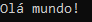

# Aula 1: Variáveis

## Criando um projeto
Para seguir a tradição da programação, vamos fazer nosso primeiro programa devolver uma mensagem. Essa mensagem é “Olá Mundo!”

Antes de começar, você vai precisar do Visual Studio e de alguns pacotes para poder fazer aplicações desktop. Se você não tem o Visual Studio ainda, pode usar o Unity Hub ou ir no site da Microsoft. Nós temos um tutorial para cada caso, [Que você pode ver clicando aqui](Configurando%20o%20Ambiente%20de%20Desenvolvimento). Tenha em atenção se você instalou pelo Unity Hub, porque vai precisar de adicionar o pacote .NET desktop development à sua instalação. Basta para isso abrir o Visual Studio Installer, que veio junto, e selecionar ele. Isso tudo tá explicado no tutorial, então, de novo, [Clica aqui!](Configurando%20o%20Ambiente%20de%20Desenvolvimento)

Vamos abrir o Visual Studio, clicar em **Arquivo > Novo > Projeto...** E depois selecionar em **Aplicativo do Console (.NET Framework)**. Se vc estiver usando MAC, pode ser o **.NET Core**, não faz mal.
Damos um nome à nossa aplicação e clicamos em criar.
Na direita nós temos a hierarquia do nosso projeto. Por enquanto, só temos uma classe “Program.cs”, que é onde tudo começa.

## O primeiro programa
Todo programa precisa de um método chamado Main para funcionar, é onde a primeira linha de código do programa todo começa.
Aqui nesse arquivo “Program.cs” já temos alguns nomes. Um deles é o namespace, que vamos ignorar por agora, outro é a classe, que se chama Program, e o outro é o Main, que é o nome do nosso método.


Toda classe é composta por dados e operações, que em linguagem de programação se chamam métodos (ou funções). Esse Main é simplesmente um dos vários métodos que uma classe pode ter, mas a gente vai falar mais a fundo disso tudo. Por enquanto só queremos criar um programa.

Dentro do método Main, escrevemos essas linhas de código:

```cs 
Console.Out.WriteLine("Olá mundo!");
Console.ReadLine();
``` 

Aqui a gente vai ter que afiar o inglês, mas é bem simples. No caso, estamos dizendo para o **Console** escrever(**WriteLine**) a frase “Olá mundo!”. Essa frase é um tipo de dado chamado string. Para poder diferenciar strings de código, colocamos elas dentro de aspas **"**.

As chavetas **"{"** e **"}"** significam início e fim de um bloco de código. Quando o nosso programa passar pelo fim, ele vai terminar e vai fechar o Console, então não vamos conseguir ler a mensagem a tempo pois passará muito rápido. Para evitar isso colocamos o código **Console.Read()**, em que o console vai ficar a espera que nós introduzamos alguma coisa, então o console não vai fechar.
Para rodar o código, é só clicar em Iniciar ou apertar o atalho **F5!**



Claro que isso é bem chato e esse programa é meio inútil né, mas vamos aos poucos.

## Declarando Variáveis

Na maioria dos programas que escrevemos, não estamos interessados em apenas mostrar uma caixa de mensagens para o usuário. Queremos também armazenar e processar informações.
Para armazenar informações, usamos variáveis, e cada variável tem um tipo específico. Um número inteiro é do tipo **integer**, números reais são do tipo **double**, valores que podem ser apenas verdade ou falso são **bool**eans, e por aí vai.

Digamos que você esteja vendo a tela da sua conta do banco. Nela vão ter algumas informações. Para mostrar algumas dessas informações no texto do console, podemos separar elas em variáveis.

Portanto, para declarar uma variável primeiro dizemos seu tipo – no caso é um int, que representa números inteiros e o nome da variável, e depois “numeroConta” – Atenção que é sem acentos. Para finalizar a linha de código, colocamos um **“;”** Isso indica ao compilador que terminamos o código daquela linha. Fica assim:

```cs 
int numeroConta;
``` 

Nunca se esqueça do **;**!

Depois de declarar uma variável, podemos armazenar valores nela. Podemos por exemplo guardar um valor na variável “numeroConta”, escrevendo na próxima linha:

```cs 
int numeroConta;
numeroConta = 1;
``` 


Aqui temos uma coisa diferente da programação para a “linguagem normal”. Esse código se lê **“numeroConta recebe 100”**. A comparação de igualdade é uma expressão que é escrita de forma diferente, que vamos ver num outro tutorial.

Por fim, para escrever esse código de forma mais direta, podemos passar um valor para a variável assim que a criamos. Por exemplo podemos criar outra variável chamada saldo assim:

```cs 
double saldo = 500.0;
```

## Operações

Após fazer o código acima, sabemos que a conta de número 1 tem um saldo de de 500. Como você é uma boa pessoa, você transferiu 100 reais para um amigo que estava necessitado. Temos então que atualizar o valor do saldo, isso pode ser feito assim:

```cs 
saldo = saldo – 100;
```

Lê-se “saldo recebe (saldo-100)”. Ou seja, o valor armazenado na variável saldo após essa linha é 400. Podemos então subtrair valores com o operador “-“, somar com “+”, multiplicar com “*” e dividir com “/”.
Mas pô, tenho mesmo que ficar repetindo saldo saldo saldo saldo em todo lado? Programadores são preguiçosos por natureza, até mesmo aqueles que fazem a linguagem de programação! 

Por isso, dá para resumir essa expressão assim:

```cs 
saldo -= 100;
```

Essa linha significa exatamente a mesma coisa que a que escrevemos antes (“saldo = saldo – 100;”). Quando você usa “-=”, o compilador completa as lacunas para a gente. O mesmo vale para os outros operadores. Use isso para deixar sua vida mais rápida!

Bem, depois disso, falta só adicionar algumas mensagens para você saber quanto é seu saldo após seu ato de bondade eterna:

```cs 
Console.Out.WriteLine("Saldo após transferência: " + saldo);
```

Agora se apertar F5 e rodar o código, ele vai substituir a variável pelo valor atual dela. Legal né?

O código final fica assim:

```cs 
int numeroConta;
numeroConta = 1;
double saldo = 500.0;
saldo -= 100;
Console.Out.WriteLine("Saldo após transferência: " + saldo);
```

Existem outros tipos de variável que eu não mencionei, inclusive para representar números inteiros e reais, além do int e do double. Eu vou introduzir elas aos poucos durante o curso, mas sem explicar a muito as diferenças delas. Eu fiz um tutorial extra onde eu explico a fundo sobre **tipos primitivos**. [Clica aqui](Tipos%20Primitivos) para saber mais!


## Exercícios

1. Faça um código que retorne a mensagem ‘O Guia do GameDev das Galáxias’
1. João, Pedro e Maria tem, respectivamente, 10, 15 e 17 anos. Crie 3 variáveis e calcule a média das idades. Você pode guardar a média numa variável, se assim quiser.
   Dica: A média é calculada pela soma das idades dividido pela quantidade de idades
1. Quando usamos o Console.Out.WriteLine, as mensagens dentro das aspas também podem ser guardadas em variáveis! As mensagens de texto são do tipo string, e, nesse caso, pode ser útil caso queiramos reutilizar alguma mensagem de texto.
Faça o exercício 1 novamente, mas em vez de incluir a mensagem dentro dos parêntesis do WriteLine, crie e use uma variável com essa mensagem.


