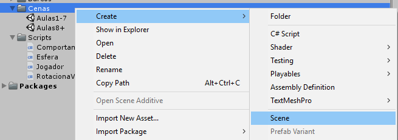

# Colisão e Rigidbody

# Aula

Link para vídeo-aula: https://www.youtube.com/watch?v=4Y0h8mixipc

# Introdução

Vamos falar hoje de um componente muito especial chamado **Rigidbody**. Toda game engine tem configurações que simulam a física, e o componente _Rigidbody_, quando adicionado ao um objeto de jogo, permite que esse objeto seja então controlado pela física.

## Rigidbody e a gravidade

Vamos então brincar com uns _Rigidbodies_. Aqui no Unity eu tenho uma nova cena vazia, você pode criar novas cenas apertando com **botão direito na hierarquia > Create > Scene**



Criamos um Cubo (**Botão Direito na cena > 3D Object > Cube**)

Vamos resetar a posição do cubo e clicar em **Add Component > Rigidbody**

Ao apertar Play, o cubo cai!

Vamos então criar um plano para evitar que ele caia. Clique com o **botão direito na hierarquia > 3D Object > Plane**

_Plane_ é simplesmente um objeto plano. Vamos criar aqui um material e pintar de preto para fazer um pouco de contraste.

Puxamos o cubo para cima e damos play de novo. 

Meio sem graça. Que tal duplicar esse cubo apertando **CTRL+D**, mudar um pouco a posição e dar play de novo.

Ok, ta ficando melhor.

Duplicamos mais algumas vezes, agora vai ficar legal!

Agora vamos remover esses cubos todos. Vamos ver as propriedades do _Rigidbody_. Se eu quiser, posso desabilitar a gravidade. Se der play o cubo vai voar. Vamos reabilitar a gravidade. Posso também desabilitar a rotação, nesse caso os cubos deixam de rodar depois de cair um em cima do outro.

Vamos colocar o script de jogador que criamos nesse cubo. Agora podemos controlar o cubo. Aumentamos um pouco ele para parecer uma caixa de sapato. Colocamos outros cubos e formas e criamos um novo material para diferenciar. Se eu der play, vejo que eu posso bater nelas, mesmo elas não tendo um _Rigidbody_. Isso é devido ao componente _Collider_ que vem com nossos objetos.

Adicionamos um cilindro, deitar ele e achatar para parecer uma moeda, e vou criar um material novo, dessa vez amarelo.

Dou play. Veja que eu bato nas moedas! Para evitar que isso aconteça, eu vou ativar essa checkbox "is Trigger"

Isso significa que agora a colisão faz "trigger" de um evento que me indica que eu colidi, mas não me impede de realizar a colisão. Agora eu atravesso as moedas, mas nada mais acontece. Se quisermos ter controle sobre o que acontece num evento de colisão, podemos fazer um método OnTriggerEnter. Vou colocar uma mensagem para quando colidirmos. Fica assim:

```cs
public void OnTriggerEnter(Collider objColisao)
{
    Debug.Log("Houve uma colisão!");
}
```

Para efeito dramático, vamos fazer as moedas sumirem quando a gente tocar, assim:

```cs
public void OnTriggerEnter(Collider objColisao)
{
    Destroy(objColisao.gameObject);
}
```

E agora ja temos um pacman em 3D! Mas do jeito que tá, eu vou destruir qualquer objeto que tiver is trigger. Nem sempre a gente quer destruir qualquer objeto com is trigger, ou queremos fazer lógica diferente para cada um desses objetos e por isso a gente tem que ter uma forma de diferenciar eles.

Para isso, temos uma coisa legal no inspetor que são as tags. Vou selecionar todas as moedas e aqui no inspetor vou clicar em tags. Por padrão o Unity já tem algumas tags aqui, mas eu quero uma tag que indique claramente que isso é uma moeda, então vou criar uma nova clicando em *Add Tag*.

Vou escrever um nome... "Moeda", e vou abrir o código do jogador. Lá no OnTriggerEnter, vou verificar se o objeto de jogo que eu colidi foi uma Moeda, assim:

```cs
public void OnTriggerEnter(Collider objColisao)
{
    if (objColisao.tag.Equals("Moeda"))
    {
        Destroy(objColisao.gameObject);
    }
}
```

Para demonstrar vou tirar a tag moeda de uma das moedas. E pronto, a última moeda não some!


## Exercícios

1. Qual é a diferença entre um _Collider_ com _IsTrigger_ setado para true e para false?

R: O IsTrigger == true faz com que a engine apenas detecte a colisão, mas não aplique nenhuma física a ela.

2. (Para Pesquisar) Para que serve a opção "Is Kinematic" do _rigidbody_? Habilitá-la iria fazer alguma diferença?

R: Torna o rigidbody controlável apenas por animação, sendo assim a física deixa de atuar no rigidbody.