# Prefabs

# Aula

Link para vídeo-aula: https://youtu.be/KIzPkViZOG0

# Aviso

Esse tutorial foi feito para versões do __Unity *2018.3*__ ou maiores. 

Antes dessa versão não existia _Prefab Mode_ e criar prefabs aninhados não era uma solução viável. Se a sua versão for menor que essa, você NÃO irá ver a mesma coisa no seu Editor (os conceitos, porém, são utilizáveis).

# Introdução

O sistema de prefabs do Unity nos permite configurar e guardar objetos de jogo com todos os seus componentes e partes internas. Portanto prefabs são como um _template_, um __modelo__, de onde você pode criar novas __instâncias de prefabs__ na cena. A palavra Prefab é uma versão curta de "Pré Fabricado".

Basicamente, sempre que quisermos __*re*__*utilizar* um certo objeto, é ideal transformarmos ele num prefab.

## O Problema

Vou demonstrar a utilidade deles aqui no Unity. Vamos criar um cubo com __botão direito na hierarquia > 3D Object > Cube__:

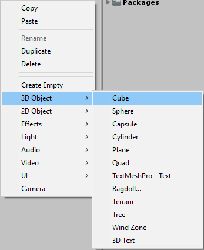

Resete o transform apertando __botão direito no transform > Reset__

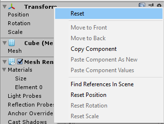

Agora selecione o cubo e aperte __CTRL+D__ para criar uma cópia do Cubo. Puxe essa cópia para a direita usando o __move tool__.

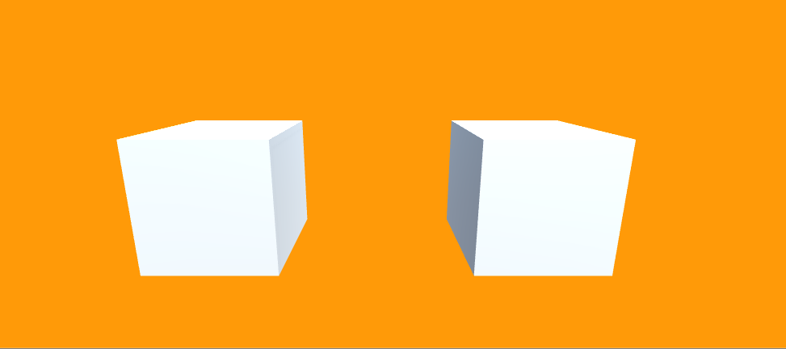

Agora, na pasta do projeto, crie uma sub-pasta na pasta _Materiais_ chamada __Aula11__. Vamos criar aqui um material da mesma forma que fizemos nas últimas aulas. Mude a cor desse material, e aplique cubo cópia. Aqui você já vê o primeiro problema de não criar prefabs. Imagina que em vez de um cubo você tem uma árvore, uma pedra, uma cadeira... Se você quiser mudar alguma coisa do seu objeto, vai ter que procurar todos os seus objetos na cena e mudar manualmente!

## Prefabs ao Resgate 

Vamos fazer diferente. Crie uma sub-pasta __Aula11__ numa pasta __Prefabs__. Remova a cópia do cubo (Cube (1)) e arraste o Cube para _Aula11_:

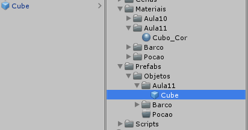

Isso vai criar um Prefab! Você pode ver que o icone do objeto fica azul. Agora adicione o _Cube_ novamente na cena, dessa vez usando o prefab que acabamos de criar. Você pode fazer isso simplesmente arrastando o objeto para dentro da hierarquia. Vamos ter dois cubos, assim como antes.

Agora vamos ver a magia acontecer. Dê dois cliques no Cube prefab na sua pasta Aula11, ou clique na seta para a direita

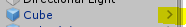

Com isso, você vai entrar no *Prefab Mode*, um modo de edição de prefabs. Recomendo você colocar a tab _Game_ em algum lugar à vista para ver as alterações acontecerem. Vamos tentar agora mudar a cor como fizemos antes:

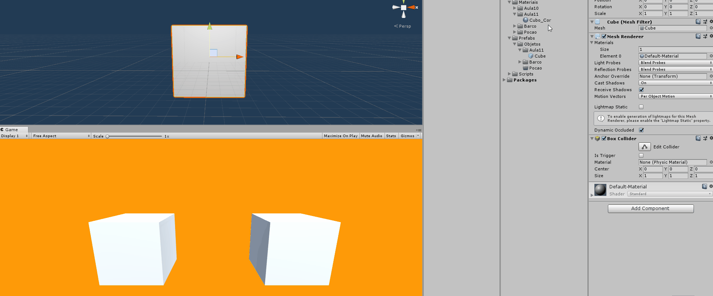

Clique na seta da esquerda para voltar.

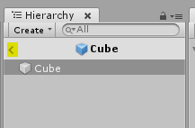

Pronto. Agora suas alterações foram feitas para todos os objetos da cena.

Caso você queira alterar os objetos mas sem sair da Cena onde eles estão, até para poder ter uma referência e coisas do tipo, você pode fazer normalmente aqui na cena. Por exemplo, vou aumentar o tamanho do cubo.

Depois de alterar você pode ir nesse Dropdown __Overrides__, e lá ele irá mostrar as mudanças feitas no seu cubo:

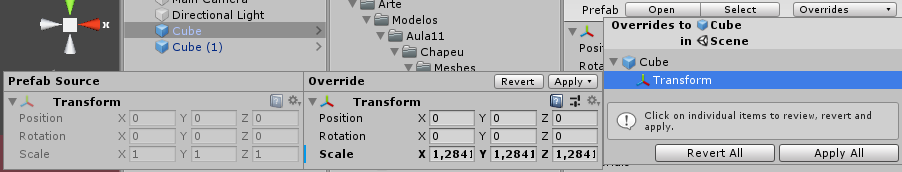

Clique em apply all quando estiver satisfeito, e você vai ver que todos os outros objetos serão atualizados também.

E pronto, aprendemos basicamente sobre prefabs. Mas não vamos parar por aqui. Pode ser que algumas alterações a gente queira que seja aplicada para todos os objetos, mas outras sejam aplicadas apenas para alguns. Então vamos avançar mais um pouco e conversar sobre __nested prefabs__, e __variantes de prefab__.

## Nested Prefabs

Nested prefab é um termo inglês que significa simplesmente um prefab que está dentro de outro prefab. Imagina por exemplo que você tenha vários prefabs de jogadores e todos tenham um chapéu igual. Se você alterar a cor do chapéu em um desses jogadores, essa mudança não será aplicada para todos os outros jogadores. Para resolver isso, podemos criar um prefab do chapéu e colocar dentro do prefab de cada um dos jogadores. Assim, modificar o chapéu resultará em todos os jogadores tendo aquele chapéu modificado.

Vamos ver isso na prática. Vou remover esse segundo cubo e criar um novo objeto, dessa vez um cilindro. Vou também criar um Prefab desse cilindro. Temos aqui um modelo de um chapéu. Vamos dar dois cliques no meu Cubo e vou colocar o chapéu aqui dentro. Agora vamos dar dois cliques no Cilindro que criamos e colocar o chapéu lá também. 

Pronto, agora temos nested prefabs. Então se eu dar dois cliques no chapéu para abrir o prefab dele e por exemplo mudarmos o material, agora a nova cor vai ser aplicada para todos os prefabs que usam esse prefab do chapéu. Legal, né?

## Variantes de Prefab

Variantes de prefab servem para eu criar variações de um mesmo prefab mas mantendo algumas características comuns. Por exemplo, digamos que eu tenha uma garrafa de poção e então crie uma variante dessa garrafa com um liquido vermelho, para recuperar vida, e outra com liquido azul, para recuperar mana.

A partir daqui, eu posso fazer alterações na garrafa base como por exemplo mudar a cor da rolha, e ela também irá mudar em todas as variantes.

Colocando em prática, aqui na cena eu vou desligar a visibilidade do cubo e do cilindro. Vamos colocar a poção base aqui na cena para ver. Agora aqui na pasta do projeto aperte __botão direito no prefab da Pocao > Create > Prefab Variant__. Vou nomear de Pocao_Vida. Vamos colocá-la na cena também. Damos duplo clique aqui na Pocao_Vida, e selecionamos o liquido. Vou trocar o material do Liquido de "Default-Material" para "Liquido_Vida". Agora temos duas garrafas de poção na cena:

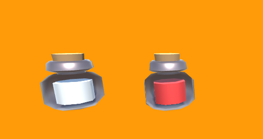

Vou criar outra variante, para Poção de Mana, usando o mesmo processo.

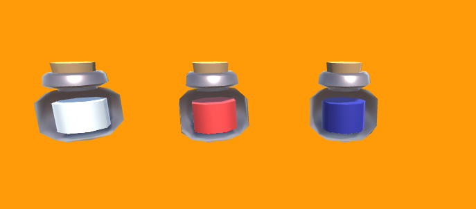

E o mais bacana é que podemos fazer variantes com nested prefabs! Vou criar mais uma variante, mas para veneno. Nessa última, vou adicionar um novo prefab com um rótulo. Vou colocar um material verde no liquido.

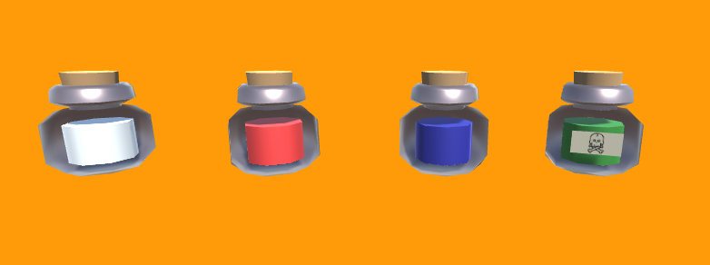

E pronto. O mais legal dessas variantes é que se por exemplo eu entrar aqui no prefab da poção base e aumentar o tamanho da garrafa, todas as outras garrafas vão aumentar de tamanho também, porque as variantes não estão alterando o tamanho da garrafa, mas se eu modificar o liquido e colocar algum outro material, essas mudanças não vão ser repassadas para as variantes porque elas estão sobre-escrevendo essa parte.

É isso por hoje. Nos vemos na próxima aula!

## Exercícios

1. Qual é a maior utilidade de um *prefab*?

2. O que é um nested prefab?

3. Se, além de mudar a cor do chapéu, eu também mudasse o tamanho, essa mudança iria ser aplicada para todos os nested prefabs que usam esse chapéu?

4. Como criar uma variante de um prefab? Escolha uma opção

A. Aperte **CTRL+D** no Prefab para duplicar ele.
B. No modo prefab, salve as alterações com um novo nome
C. Clique com o botão direito no prefab e escolha "Create > Prefab variant"

5. Digamos que eu tenha criado uma nova variante do prefab **Pocao**. Nessa variante, eu removi o objeto de jogo Liquido em vez de mudar a cor dele, criando assim uma garrafa de poção vazia. Se eu alterar a cor da rolha ou o tamanho da garrafa no prefab base **Pocao**, essa mudança afetará as variantes também?
