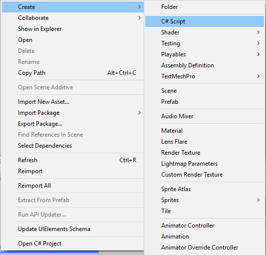

# Introdução Unity - Scripts e MonoBehavior


## Introdução

Scripts criados em Unity são componentes para definir comportamento. Como todo componente, eles podem ser aplicados a um objeto de jogo. 
Um objeto de jogo é qualquer coisa que existe dentro de uma cena em um jogo.

Para criar uma cena, precisamos de um projeto de jogo. 


## Criando um projeto

Vamos abrir o Unity Hub e criar um projeto. Se você não tiver o Unity e quiser saber como instalar, faça uma pausa e dê uma olhada nesse video do canal. 

Clique aqui!
[](https://youtu.be/-LXioG33sN0)


## Adicionando um objeto de jogo: cubo

Nessa cena vazia inicial, podemos adicionar objetos de jogo, por exemplo um cubo, apertando o **botão direito na hierarquia > 3D Object > Cube**.


## Componentes do objeto cubo

Esse cubo já possui por padrão alguns outros componentes, como o **Mesh Filter** que **define uma geometria para o nosso objeto**, que no caso é um cubo,
mas poderia ser um cilindro, uma esfera, ou até mesmo objetos mais complexos, como um carro e uma casa. 

Outro componente é o **Mesh Renderer**, que **renderiza o objeto geométrico do Mesh Filter** na cena. Nele também definimos um tipo de material para nosso objeto. Poderia ser um metal, madeira, pedra, terra, etc... No caso, está definido o material padrão do Unity: Default-Material


Por último, temos o Box Collider, que define os limites do corpo do cubo para detectar colisão com outros colliders. Existem muitos outros componentes, e sempre que você tiver alguma dúvida, pode consultar o Manual do Unity clicando nesse botão.


## Scripts customizados

Mas estamos aqui para falar de scripts! Podemos adicionar um script a esse cubo para definir um comportamento customizado. Para adicionar um script, pode criá-lo no seu projeto apertando o **Botão direito > Create > C# Script**, vou chamar de ComportamentoExemplo, e depois arrastando-o para dentro do Cubo.




Se você der duplo-clique no script ele vai abrir no seu editor de código C#, no meu caso é o Visual Studio. Imediatamente vemos dois métodos já feitos: Start() e Update().


O Start() é um método que é executado apenas no primeiro frame em que aquele objeto é ativado. Ele é bom para definirmos variáveis que vamos utilizar no resto do Script. Por exemplo, vamos guardar o nosso MeshRenderer dentro de uma variável usando o método GetComponent<>:

```cs
private MeshRenderer _renderer;
void Start () 
{
    _renderer = GetComponent<MeshRenderer>();
}
```

O Update() é um método que ocorre a cada frame de execução do jogo. Lembra do FPS nos jogos? Frames por segundo? Para cada um desses frames, o Update é executado. Portanto, como você pode ver, é um método que é executado muitas vezes, então muito cuidado para não colocar código de performance intensiva nele. São coisas desse tipo que ajudam a fazer o FPS cair nos jogos. Scripts, de forma geral, rodam no PROCESSADOR, e não na placa de video, por isso não basta uma boa placa de video para rodar um jogo pesado. Também precisamos de um bom processador.

Aproveitando, vamos fazer algumas coisas nesse update. Primeiro, vamos detectar que o jogador apertou um botão, no caso, o botão R:

```cs
if (Input.GetKeyDown(KeyCode.R))
{
}
```

O código irá entrar nesse *if* caso o jogador aperte a letra R. Vamos fazer o cubo mudar de cor:

```cs
if (Input.GetKeyDown(KeyCode.R))
{
    _renderer.material.color = Color.red;
}
```

Explicando esse código... Lembra que o GetComponent obteve o nosso Mesh Renderer? E que o Mesh Renderer tem um material acoplado a ele, no caso, o "Default-Material":


Nesse caso ao fazer *_renderer.material*, estamos selecionando esse material. E ao fazer *.color* depois disso, mudamos a cor do material!
Dando Play e apertando R, você verá que o Cubo agora muda de cor para vermelho!


Para terminar, vamos adicionar outro tipo de componente ao objeto. Um Rigidbody. Clicando em **Add component** no Inspetor do Cubo, e procurando por "Rigidbody". 


Ao fazer isso estamos adicionando massa e interação física a esse objeto, e após clicarmos no Play, o cubo cai.


## Exercícios

1. Como faríamos para mudar a cor para azul em vez de vermelho?

2. Faça um efeito de *toggle* entre azul e vermelho. Ou seja, se o cubo estiver vermelho e o botão R for apertado, ele muda para azul, e vice-versa

3. (Para pesquisar) Além do Start(), há também o método Awake() na classe MonoBehavior que faz uma função semelhante, mas com algumas diferenças. Pesquise sobre o método Awake() e, considerando o exemplo da aula em que inicializamos uma variável, qual era o método mais adquado para usar naquela situação? Start() ou Awake()? 
Dica: Pesquise na documentação do Unity: https://docs.unity3d.com/ScriptReference/index.html e https://docs.unity3d.com/Manual/index.html. É um hábito MUITO importante!

4. (Para pesquisar) Além do método *Update()*, há também o *FixedUpdate()*, que é similar. Qual é a diferença deles e quando é melhor usar um ou outro?

5. (Para pesquisar) Se o *Update()* ocorre em todo frame, e é perfeitamente possível rodar jogos a mais de 100 FPS(frames por segundo), de que forma é possível termos por exemplo um relógio de contagem regressiva que é atualizado a cada update? Como podemos ter controle sobre o tempo?
