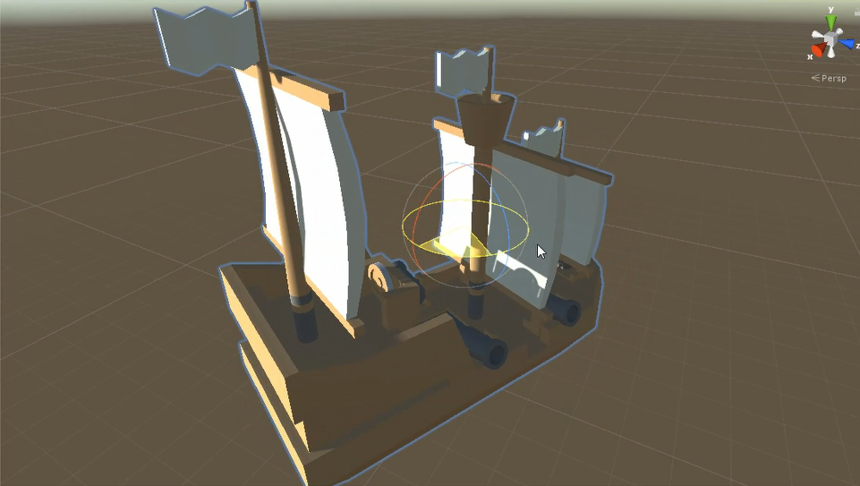
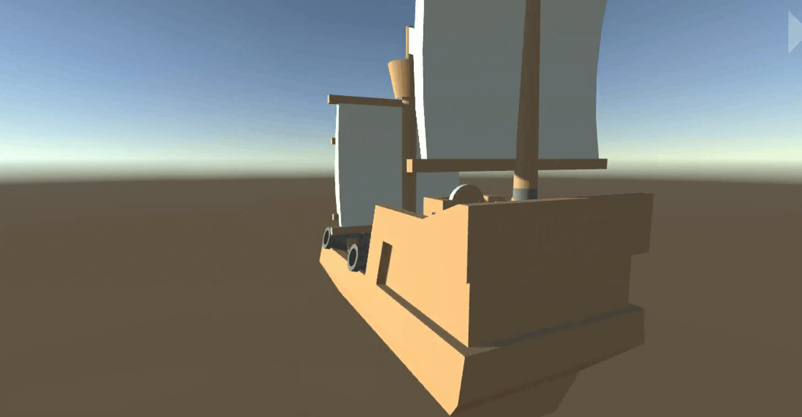

# Espaço global e local

## Aula

Vídeo da Aula: https://www.youtube.com/watch?v=hHgPwHor7Ow

## Espaço

No Unity, existe a noção de **espaço global e local**. Isso é um conceito importante para trabalharmos mais a fundo ao mover objetos.

## Espaço Global

Um Espaço tridimensional é definido por três eixos: o eixo X de largura, o eixo Y de altura, e o eixo Z de profundidade. O espaço global apenas nos diz que a direção desses eixos é constante em relação ao mundo. Por exemplo, vamos mudar esse objeto de local para global: 

Agora se mudarmos um pouco a posição dele, esse objeto se comportará de certa maneira:

Agora vamos clicar no botão "Rotate tool" ou apertar a letra "E" e girar esse objeto.

Vamos clicar de novo na "Move tool" ou apertar o botão "W" e tentar mover ele de novo. Apesar do objeto estár apontando para outra direção, as direções globais permanecem a mesma.

## Local

Vamos agora mudar aqui em cima a direção para "local". 

Repare que as direções dos eixos mudaram, e, como o nome já diz, elas estão relativas ao objeto local. Se tentarmos mover o objeto de novo, o resultado será diferente
 

Esse conceito é muito importante de entender para não se confundir caso tente mover um objeto, especialmente por código, e ele não vá para a direção que a gente espera.

