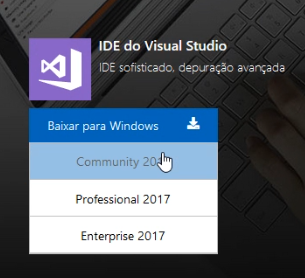
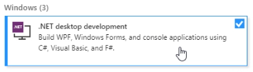
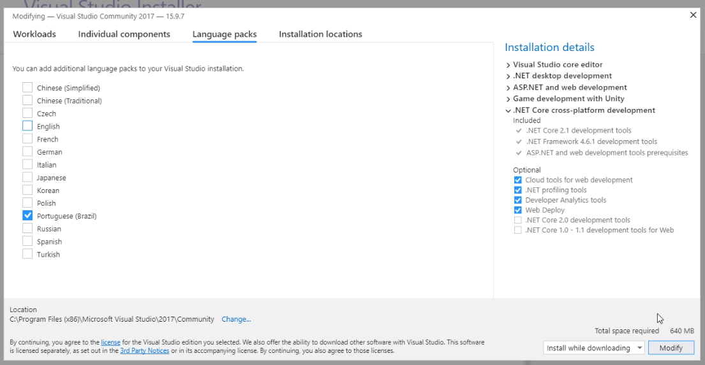

# Configurando o Ambiente de Desenvolvimento

## Baixando o Visual Studio

Para poder fazer o curso de programação, a gente vai precisar de uma IDE. IDE significa **Integrated Development Environment**, ou, Ambiente de Desenvolvimento Integrado. Nela, podemos escrever código que pode ser interpretado e executado pela máquina. 

Para baixar o Visual Studio você pode incluir ele no pacote do editor Unity, através do Unity Hub ou pelo site da Microsoft.

Para ambos os casos, temos um video pronto!

## Visual Studio pelo site da Microsoft

Link para o video: https://youtu.be/qkJK8kMYq_8

Entre em https://visualstudio.microsoft.com e, onde está IDE do Visual Studio, clique "Baixar para Windows" e escolha **Community 2017**. 

A versão atual é 2017, mas se for uma versão mais recente, não tem problema, o código do curso deve funcionar normalmente.

Depois de clicar em "Community 2017", uma nova página vai abrir em que o download irá iniciar automaticamente. Após baixar, instale normalmente.

Ao fim da instalação, o Visual Studio Installer deve abrir automáticamente. Se não, abra o Iniciar e procure por Visual Studio Installer. 

Quando abrir, escolha a opção **.NET Desktop Development** e depois em *install* para poder seguir o resto do tutorial de programação.

Se quiser traduzir seu Visual Studio, você pode instalar o pack de linguas em Português através da aba "Language packs":

## Tradução PT-BR

Se quiser traduzir seu Visual Studio, você pode instalar o pack de linguas em Português através da aba "Language packs":

